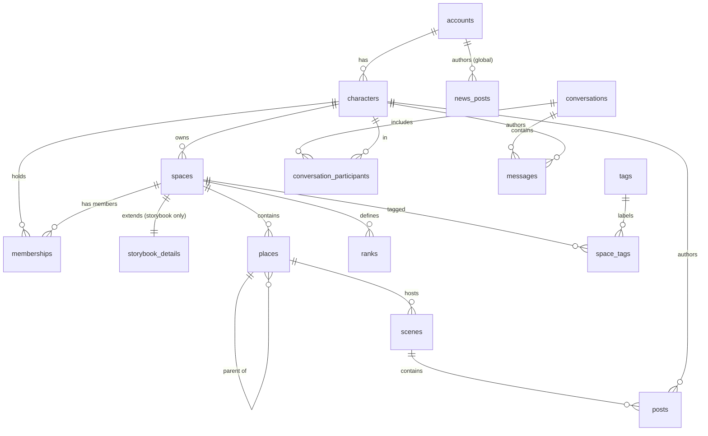

# Data Model — "When Worlds Collide"

Reference schema for the play-by-post RPG portal. This is the source of truth the
SQLAlchemy models and migrations are built against. Conventions follow the existing
codebase: `GUID` primary keys (`uuid4`, portable across Postgres/SQLite), plural
snake_case table names, `back_populates` relationships. New tables carry `created_at`;
the pre-existing `accounts` / `characters` tables are left as-is for now.

---

## Core concepts

- **Account** — one per human user; holds login + the global-admin flag.
- **Character** — an Account has many; you act *as* a Character. Ownership of everything
  in-world is by Character, not Account.
- **Space** — a container you play in. One table for both **StoryBooks** and **Houses**
  (`type` discriminator); they share all relationships (places, membership, scenes), so
  they share the table. StoryBook-only discovery fields live in `storybook_detail`.
- **Place** — a self-referencing tree inside a Space; where play happens.
- **Rank** — a configurable Space-local rank ordered by priority (`1` strongest).
- **Scene** — one RP thread inside a Place. A Place has at most one *active* scene plus a
  browsable history of past ones.
- **Post** — one turn inside a Scene, authored by a Character.
- **Conversation / Message** — the PM system. Deliberately **separate** from Scene/Post:
  same "threaded messages" shape, different rules — so different tables.
- **Comm modules** (News / Gesuche / OOC) — each exists at two **scopes**: global and
  per-Space.

---

## Permission model — `(who, role, where)`

Two scopes, no middle tiers (moderators etc. are explicitly out of scope for now):

| Layer | Who | Where | Stored as |
|---|---|---|---|
| Global admin | Account | whole site | `accounts.is_global_admin` |
| Space creator/editor/member | Character | one Space | `memberships` row |

A permission check is always "does this actor have role X in scope Y?" Global-admin
checks look at the **Account behind the current character**, so admin power shines through
whichever character the user is currently playing.

---

## ER diagram

---

## Tables

### accounts *(existing — one change)*
| column | type | notes |
|---|---|---|
| id | GUID pk | |
| email | string unique | |
| login_name | string unique | |
| password_hash | string | |
| **is_global_admin** | bool default false | **new** — global permission layer |

### characters *(existing — unchanged)*
`id, name, race, specification, gender, account_id → accounts`

### spaces *(new — unified StoryBook + House)*
| column | type | notes |
|---|---|---|
| id | GUID pk | |
| type | string | `'storybook'` \| `'house'` |
| owner_character_id | GUID → characters | creator; auto-gets a `creator` membership |
| title | string | |
| description | text | homescreen / landing content |
| scene_timeout_days | int default 90 | occupancy backstop; both types have scenes |
| created_at | datetime | |

### storybook_details *(new — 1:1 extension, StoryBook-only fields)*
| column | type | notes |
|---|---|---|
| space_id | GUID pk → spaces | 1:1 |
| visibility | string | `'generic'` \| `'public'` \| `'private_listed'` \| `'private_hidden'` |

Houses simply have no `storybook_details` row. Discovery/visibility is meaningless for them.

### tags *(new)*
`id GUID pk, name string unique`

### space_tags *(new — M:N)*
`space_id → spaces, tag_id → tags` (composite pk)

### memberships *(new — Character × Space with role)*
| column | type | notes |
|---|---|---|
| id | GUID pk | |
| space_id | GUID → spaces | |
| character_id | GUID → characters | |
| role | string | `'creator'` \| `'editor'` \| `'member'` |
| created_at | datetime | |

Unique `(space_id, character_id)`. Same character can be creator/editor of one Space and
member of another — role lives on this link, not on the character or the space.

Role meaning:
- `creator`: the character that created/owns the Space; full Space permissions.
- `editor`: granted by the creator; may edit Space settings/content.
- `member`: belongs to the Space but cannot edit settings/content.

### places *(new — nested tree inside a Space)*
| column | type | notes |
|---|---|---|
| id | GUID pk | |
| space_id | GUID → spaces | |
| parent_place_id | GUID → places, nullable | self-ref; null = top level |
| title | string | |
| description | text | |
| image_url | string, nullable | |
| sort_order | int default 0 | order among siblings |
| created_at | datetime | |

### ranks *(new — configurable Space ranks)*
| column | type | notes |
|---|---|---|
| id | GUID pk | |
| space_id | GUID → spaces | |
| name | string | display name |
| weight | int | priority; `1` is strongest/highest |
| created_at | datetime | |

Creators/editors maintain ranks from Plot Settings. Rank lists are ordered by ascending `weight`,
with lower numbers first.

### scenes *(new — one RP thread inside a Place)*
| column | type | notes |
|---|---|---|
| id | GUID pk | |
| place_id | GUID → places | |
| title | string | the RP name (from the required first-post title) |
| last_post_at | datetime | **source of truth for occupancy** |
| finished_at | datetime, nullable | set when a participant clicks "RP beenden" |
| created_at | datetime | |

**Status is derived, not stored** (no cron needed to stay correct):

- `finished_at` set → **finished** (happy-end badge)
- else `now - last_post_at > space.scene_timeout_days` → **inactive** (auto-freed, unknown end)
- else → **active** → the Place shows **Occupied**

**Participants are derived** from the distinct `author_character_id` of the scene's posts —
no participant table (we dropped join/leave tracking). Powers the avatar row and "N Teilnehmer".

A Place is **Occupied** iff it has a scene that is currently *active*. Reopening a finished
scene = clear `finished_at` (allowed as long as no newer active scene exists in the Place).

### posts *(new — one turn inside a Scene)*
| column | type | notes |
|---|---|---|
| id | GUID pk | |
| scene_id | GUID → scenes | |
| author_character_id | GUID → characters | |
| body | text | rich text (HTML) |
| created_at | datetime | |
| edited_at | datetime, nullable | "last modified" tracking |

The scene title lives on `scenes`, not per-post; only the first post "has" a title (it *is*
the scene title). Creating a post bumps the scene's `last_post_at`.

---

## PM system *(separate tables — shares the shape, not the rules)*

### conversations *(new)*
| column | type | notes |
|---|---|---|
| id | GUID pk | |
| is_group | bool default false | 1:1 vs group chat |
| title | string, nullable | optional group name / system notification title |
| created_at | datetime | |

### conversation_participants *(new — Character × Conversation)*
`conversation_id → conversations, character_id → characters` (composite pk)

Inbox is **aggregated by Account** (you see every conversation any of your characters is in).
**Reply-as rule:** you post as whichever of *your* characters is a participant — 1:1 has
exactly one such character (fixed identity, no dropdown); group may have several (dropdown,
defaulting to your currently-logged-in character if they're a participant).

System notifications also use the PM system: the backend may create a conversation with the
notified character(s) as participants and insert a system-authored message. Example: when a
creator/editor adds a character to a Plot/Space, the added character receives a PM such as
"You were added to Supermarket as Cashier". These notifications should be generated by the
backend at the same time as the state change, not by the frontend.

### messages *(new)*
| column | type | notes |
|---|---|---|
| id | GUID pk | |
| conversation_id | GUID → conversations | |
| author_character_id | GUID → characters, nullable | null for system messages |
| kind | string default `'user'` | `'user'` \| `'system'` |
| system_key | string, nullable | stable key for generated messages, e.g. `'space_member_added'` |
| body | text | lightweight (no title / rich text / export) |
| created_at | datetime | |

---

## Comm modules — scoped `global | space` *(News / Gesuche / OOC)*

Each is the same feature at two scopes. Scope pattern on every row:
`scope_type ('global' | 'space')` + `space_id` (null when global). Three separate tables
(different bodies/rules), all sharing that scope pattern:

- **news_posts** — `scope`, `space_id?`, `author_character_id`, `title`, `body`, `created_at`.
  **Write-gated:** global = global admin; space = space admin. Read = anyone in scope.
- **gesuche** — `scope`, `space_id?`, `author_character_id`, `body`, `created_at`.
  Open read + write to anyone in scope (looking-for-RP ads).
- **ooc_messages** — `scope`, `space_id?`, `author_character_id`, `body`, `created_at`.
  Open chat for anyone in scope.

---

## Ping *(scene-lifecycle phase — no table needed to start)*

A **Ping** on an occupied Place sends the active scene's participants an actionable PM
("is this free? [Set free]"). The 3-month timeout is the automatic backstop; Ping is the
early, no-social-courage nudge. Modeled later as a system message in the PM system; no
dedicated table required for the MVP.

---

## Build order (branches)

`data-model` → `storybook-core` → `scene-posting`, then in parallel off `main`:
`scene-lifecycle`, `pm-system`, `comms-scoped`, `houses`. Each branch adds the models it
introduces and its own tests; this doc is the shared contract.
